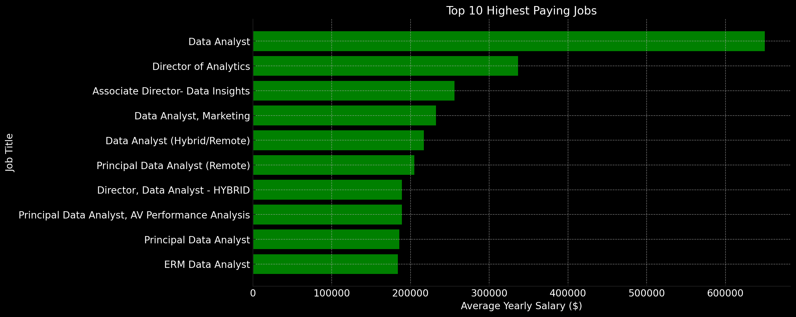
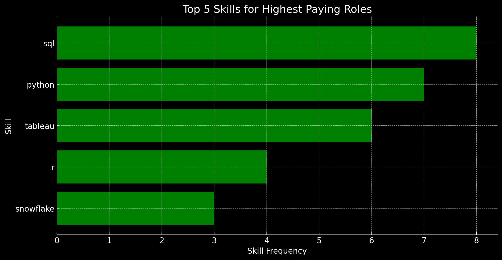
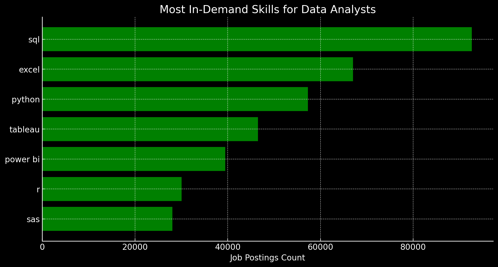

# Introduction
This project analyzes data-related job postings across various countries, with a primary focus on the U.S. and the Data Analyst role. In collaboration with Luke Barousse and YouTuber, aka. "Data Nerd, this analysis is designed for individuals pursuing a career in data analytics, like myself. The project explores the highest-paying positions and the most in-demand skills in the industry. Additionally, it serves as my first published project utilizing SQL to extract insights from job postings, strengthening my proficiency in this essential tool.

SLQ Queries: [project_sql folder](/project_sql/)

# Backgroud
As a data enthusiast on a journey to refine my analytics skills, I continuously seek opportunities to apply and expand my knowledge through hands-on projects. The purpose of this project is to deepen my understanding of SQL and explore its capabilities. A special thanks to Luke Barousse for sharing this insightful content on YouTube, which has helped many—including myself—learn, enjoy the process, and uncover valuable findings. 

### Five Questions Guide this Project’s Insights:

1. What are the top-paying data analysts jobs?
2. What skills are required for these top-paying jobs?
3. What skills are most in demand for data analysts?
4. Which skills are associated with higher salaries?
5. What are the most optimal skills to learn?

# Tools I Used
- **SQL**: The core tool for extracting meaningful insights by querying the database.
- **PostgreSQL**: The database management system selected for efficiently handling job posting data.
- **Visual Studio Code**: My preferred platform for managing databases and running SQL queries.
- **Git & GitHub**: Crucial for version control, sharing SQL scripts, and tracking project progress.

# The Analysis
SQL queries used when analyzing the data:

### 1. Top Paying Data Analysts
To identify the highest-paying roles, alongside Luke, I filtered data analysts positions by average yearly salary and location, focusing on remote jobs. This query highlights the high paying opportunities in the field. 

```sql
SELECT
    job_id,
    job_title,
    job_location,
    job_schedule_type,
    salary_year_avg,
    job_posted_date,
    name AS company_name
FROM    
    job_postings_fact 
LEFT JOIN
    company_dim
ON
    job_postings_fact.company_id = company_dim.company_id
WHERE   
    job_title_short LIKE 'Data Analyst'
    AND job_location = 'Anywhere'
    AND salary_year_avg IS NOT NULL
ORDER BY
    salary_year_avg DESC
LIMIT 10 
```
Insights gained from this analysis from the 2023 year:

- **Wide salary range:** While one Data Analyst role offers an outlier salary of $650K, most other top-paying jobs fall between $200K–$350K annually.
- **Most Frequent Companies:** Tech and analytics companies like Meta, AT&T, and Pinterest offer some of the top salaries in the dataset.
- **Variety in job titles:** The top-paying jobs include roles such as Data Analyst, Director of Analytics, and Associate Director, highlighting different levels of seniority in data-related fields.


*Bar graph visualizing the salary for the top 10 salaries for data analysts; ChatGPT generated this graph from my SQL querie results.*

## 2. Skills for Top Paying Jobs
Here, I joined the job postings with the skills data, providing insights into the key expertise employers value for the top 10 high-compensation roles.

```sql
WITH top_paying_jobs AS (
    SELECT
        job_id,
        job_title,
        salary_year_avg,
        name AS company_name
    FROM     
        job_postings_fact 
    LEFT JOIN
        company_dim
    ON
        job_postings_fact.company_id = company_dim.company_id
    WHERE 
        job_title_short LIKE 'Data Analyst'
        AND job_location = 'Anywhere'
        AND salary_year_avg IS NOT NULL
    ORDER BY
        salary_year_avg DESC
    LIMIT 10
)
SELECT 
    top_paying_jobs.*,
    skills
FROM top_paying_jobs
INNER JOIN skills_job_dim
ON top_paying_jobs.job_id = skills_job_dim.job_id
INNER JOIN skills_dim
ON skills_job_dim.skill_id = skills_dim.skill_id
ORDER BY
    salary_year_avg DESC
```
Insights gained from this analysis:

- **SQL** is the most in-demand skill across the highest-paying roles, highlighting its importance in data-related positions.
- **Python** is highly valuable, ranking just below SQL, reinforcing its dominance in analytics, machine learning, and automation.
- **Tableau** is crucial for visualization, showing the demand for professionals who can communicate data insights effectively.
- **R** is still relevant, particularly in statistical and academic settings, though not as widely requested as Python.
- **Snowflake's** presence suggests that cloud-based data warehousing skills are increasingly valuable.


*Bar graph visualizing the top 5 skills that are required of the top 10 data analyst 

## 3. Most In-Demand Skills for Data Analysts
To understand the skills most sought after in the data analyst job market, I ran a query counting the number of job postings that require each skill.

```sql
SELECT 
    skills,
    COUNT(skills_job_dim.job_id) AS demand_count
FROM job_postings_fact
INNER JOIN skills_job_dim
ON job_postings_fact.job_id = skills_job_dim.job_id
INNER JOIN skills_dim
ON skills_job_dim.skill_id = skills_dim.skill_id
WHERE
    job_title_short LIKE 'Data Analyst'
    -- AND job_work_from_home = TRUE
GROUP BY
    skills
ORDER BY
    demand_count DESC
LIMIT 10
```
Key Insights:
- **SQL** dominates with the highest demand, appearing in nearly 93K job postings. It remains the foundational skill for data analysts.
- **Excel** remains crucial, showing that despite new tools, traditional spreadsheet skills are still widely used.
- **Python** ranks third, reinforcing its importance in automation, machine learning, and data manipulation.
- **Tableau** & **Power BI** are in high demand, highlighting the significance of data visualization.
- **R**, **SAS**, and **SAP** indicate that statistical and enterprise software skills are still relevant in certain industries.


*Bar graph visualizing the most in-demand skills for data analysts with the dataset give; ChatGPT generated this graph from my SQL query results
# 4. Most Competitive Salary Skills
 In this analysis, I identified the skills associated with the highest-paying data analyst roles to determine which technical competencies yield the most lucrative salaries. By joining job postings, salaries, and skills data, I calculated the average salary for the top 25 skills and ranked them accordingly.

 ```sql
 SELECT 
    skills,
    ROUND(AVG(salary_year_avg),0) AS avg_salary
FROM job_postings_fact
INNER JOIN skills_job_dim
ON job_postings_fact.job_id = skills_job_dim.job_id
INNER JOIN skills_dim
ON skills_job_dim.skill_id = skills_dim.skill_id
WHERE
    job_title_short LIKE 'Data Analyst'
    AND salary_year_avg IS NOT NULL
GROUP BY
    skills
ORDER BY
    avg_salary DESC
LIMIT 25
```

About the Most Expensive Skills:
- **Hgh Demand for Big Data & ML Skills**: Top salaries  are commanded by analysts skilled in big data technologies (PySpark, Couchbase), machine learning tools (DataRobot, Jupyter), and Python libraries (Pandas,Numpy), reflecting the industry's high valuation of data processing and predictive modeling capabilities.
- **Software Development & Deployement Proeficiency**: Knowledge in development and deployement tools (GitLab, Kubernetes, Airflow) indicates a lucrative crossover between data analysis and engineering, with a premium on skills that facilitate automation and efficient data pipeline management.
- **Cloud Computing Expertise**: Familiarity with cloud and data engineering tools (Elacticsearch, Databricks, GCP) underscores the growing importance of cloud-based analytics enviroments, suggesting that cloud proficiency significantly boots earning potential in data analytics. 

# Top 10 Most Expensive Skills for Data Analysts

| Rank | Skill       | Average Salary ($) |
|------|------------|--------------------|
| 1    | PySpark    | 208,172            |
| 2    | Bitbucket  | 189,155            |
| 3    | Couchbase  | 160,515            |
| 4    | Watson     | 160,515            |
| 5    | DataRobot  | 155,486            |
| 6    | Databricks | 150,000            |
| 7    | Kubernetes | 148,200            |
| 8    | Snowflake  | 145,000            |
| 9    | Looker     | 142,500            |
| 10   | Tableau    | 140,000            |

*Table of the average salary for the top 10 paying skills for data analysts

# 5. Most Optimal Skills to Learn
In this analysis, I identified the most valuable skills for data analysts by evaluating their demand in job postings and their correlation with high salaries. By analyzing job postings, average salaries, and skill frequency, I determined which technical competencies offer the best combination of demand and earning potential.

```sql

SELECT
    skills_dim.skill_id,
    skills_dim.skills,
    COUNT(skills_job_dim.job_id) AS demand_count,
    ROUND(AVG(job_postings_fact.salary_year_avg), 0) AS avg_salary
FROM job_postings_fact
INNER JOIN skills_job_dim ON job_postings_fact.job_id = skills_job_dim.job_id
INNER JOIN skills_dim ON skills_job_dim.skill_id = skills_dim.skill_id
WHERE
    job_title_short LIKE 'Data Analyst'
    AND salary_year_avg IS NOT NULL
GROUP BY
    skills_dim.skill_id, skills_dim.skills
HAVING
    COUNT(skills_job_dim.job_id) > 10
ORDER BY
    demand_count DESC, avg_salary DESC
LIMIT 25;
```
**Key Takeaways for Aspiring Data Analysts**

| Rank | Skill       | Demand Count | Avg. Salary ($) |
|------|------------|--------------|-----------------|
| 1    | SQL        | 3,083        | 96,435          |
| 2    | Excel      | 2,143        | 86,419          |
| 3    | Python     | 1,840        | 101,512         |
| 4    | Tableau    | 1,659        | 97,978          |
| 5    | R          | 1,073        | 98,708          |
| 6    | Power BI   | 1,044        | 92,324          |
| 7    | Word       | 527          | 82,941          |
| 8    | PowerPoint | 524          | 88,316          |
| 9    | SAS        | 500          | 93,707          |
| 10   | SQL Server | 336          | 96,191          |


Findings:
- **SQL** remains the most in-demand skill, appearing in over 3,000 job postings. It is essential for querying databases but does not command the highest salary.
- **Python** leads in salary potential among commonly required skills, with an average salary exceeding $101K, making it a valuable tool for automation, machine learning, and advanced analytics.
- **Excel** is still highly in demand, ranking second with 2,143 job postings, but its average salary ($86K) is lower than more technical skills, showing that while necessary, it’s not the most lucrative.
- **Cloud & Big Data** skills (AWS, Azure, Snowflake, Spark) are associated with the highest salaries, with Spark leading at $113K. This highlights the growing importance of cloud-based and large-scale data processing expertise.
- **Visualization Tools** (Tableau, Power BI, Looker) remain crucial, with strong demand but moderate salaries (~$92K–$103K). This confirms that storytelling with data is valuable but is often a supporting skill rather than the primary driver of high salaries.

# What I Learned

Where do I begin?

- **SQL**: I have now a grasp of working with multiple relational tables, using joins, subqueries, and aggregations to analyze data efficiently. Through this process, I learned how to write optimized queries that extract precise insights, ensuring data accuracy and relevance. Additionally, I built my own database, downloading and structuring data for analysis, which enhanced my understanding of data modeling, schema design, and query performance.

- **Visual Studio Code**: Using SQL in Visual Studio Code, I now have hands-on experience working with real-world database manipulation. I learned how to create, load, and manage data within a structured environment, allowing me to write efficient SQL queries for analysis. This experience has helped me understand how to build and organize tables that facilitate meaningful insights, improving my ability to work with databases in a practical setting.

- **Analytical Experience**: Through this project, I enhanced my analytical skills by working with multiple tables and understanding their relationships. Although this was a relatively simple project, it provided valuable hands-on experience in structuring queries, identifying key insights, and making data-driven connections. This process helped me develop a more systematic approach to analyzing complex datasets and extracting meaningful conclusions.

- **GitHub**: I have learned how to upload, manage, and showcase my projects on GitHub, making it easier to present my skills to others. This project helped me understand how to seamlessly transfer data and code from Visual Studio Code to my GitHub repository, ensuring that my work is well-documented, accessible, and shareable with potential collaborators or employers.

# Conclusions

1. High-Demand vs. High-Paying Skills: SQL and Excel are the most in-demand skills, but cloud computing (AWS, Snowflake) and big data (Spark, PySpark) command the highest salaries, highlighting the value of specialized technical expertise.
2. Cloud & Machine Learning: Data analysts with machine learning, cloud computing, and big data skills earn significantly more, emphasizing the industry's shift toward AI-driven and scalable data solutions. Learning those skills might make you earn significantly more and might align with what is coming for the next decades.
3. Excell: Must-know tool for Data Analysts, but very specific. ~34% of Data Analyst job postings required Excel, however, only ~16% of all data-related job postings include Excel as a requirement. Combining Business and Data Analysts, they account for ~66% of all job postings that list Excel as a required skill, meaning that about two-thirds of all jobs requiring Excel are for Data Analysts and Business Analysts.
4. Tools Dependency:SQL is present in more than half of Data Analyst job postings (~58%), followed by Excel (~42%) and Python (~36%). Additionally, BI tools like Tableau (~29%) and Power BI (~25%) are highly sought after, indicating that Data Analysts need proficiency in a diverse set of tools. Looking at the broader dataset, which includes all job postings in the data marketplace, SQL remains the most in-demand skill, appearing in ~57% of postings. Python follows closely at ~57%, highlighting its critical role across various data-related roles.
- Essentials: SQL and Python are the backbone of the data ecosystem, consistently ranking as the top two required skills across data-related job postings. SQL is indispensable for data extraction and manipulation, while Python’s versatility in data analysis, automation, and machine learning makes it a fundamental tool for any data professional. Their dominance across roles underscores their necessity in the modern data-driven environment.


# Closing Thoughts

Huge thanks to Luke, who has been doing an amazing job on his YouTube channel, teaching and sharing this kind of content for free. It is truly a blessing to have the opportunity to learn from his tutorials and paid certifications. As an MBA in Data Analytics student, this course has given me both knowledge and inspiration to pursue my data analytics career.

With this project, I was able to learn the basics of SQL, data visualization, and industry-demanded skills while working with real-world job market data. It also strengthened my ability to write efficient queries, analyze salary trends, and identify high-value skills for data analysts. This experience has been instrumental in shaping my understanding of data-driven decision-making and how technical competencies impact career growth in the field. That is just the beginning stay tunned. 
